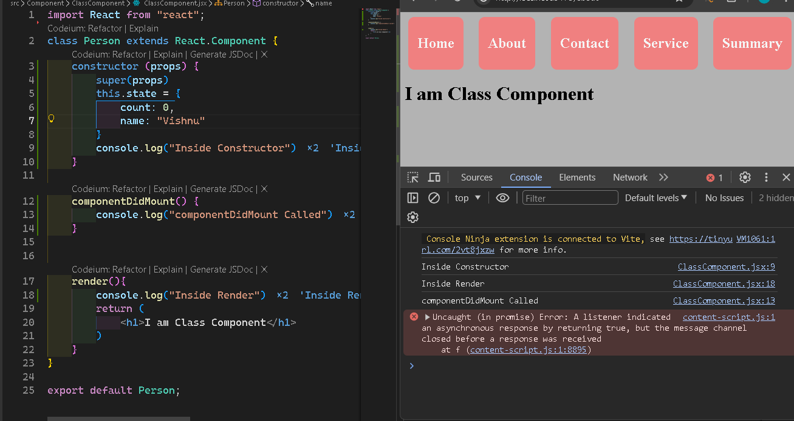
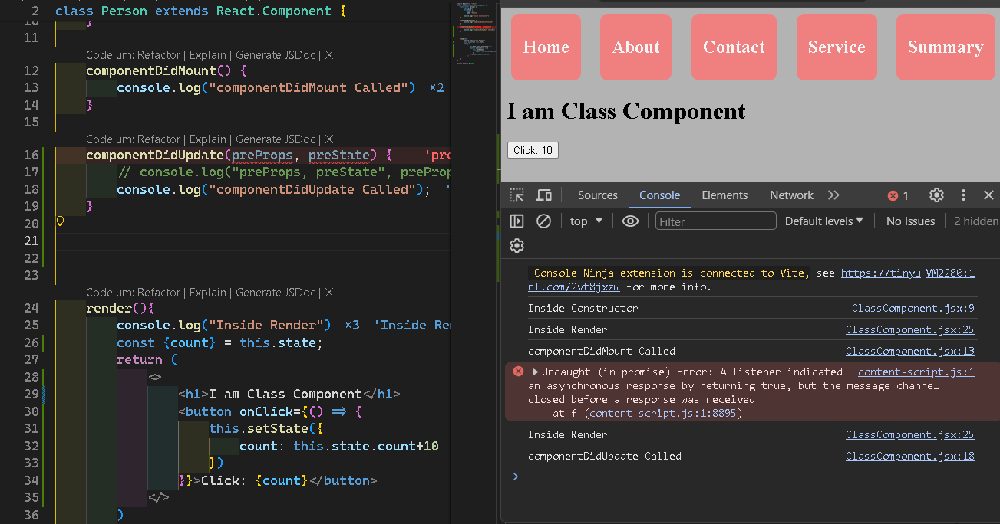
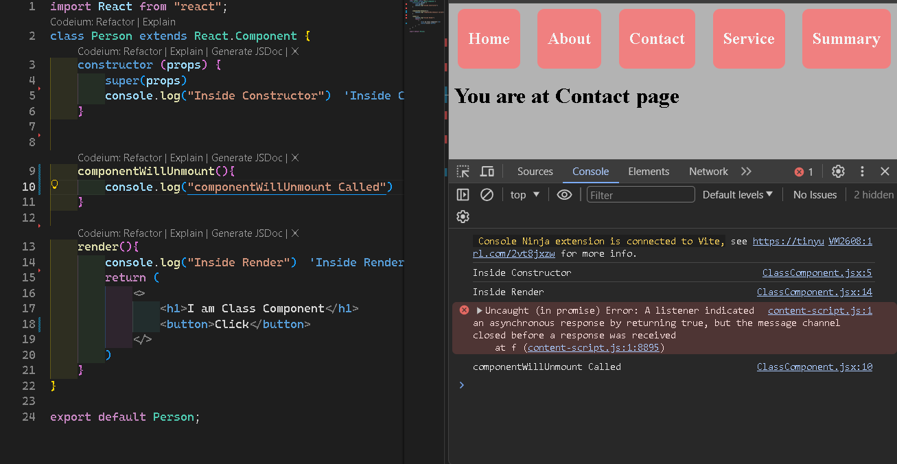

## Installation

Clone this repo:- git@github.com:codewithVRV/React_Life_Cycle_methods.git

```bash
  cd my-project
  npm install
  npm run dev
```
    
# React Life cycle Methods
There are three phases of life cycle Methods

First:- Mounting (constructor, render, componentDidMount)

Second:- Update (render, componentDidUpdate)

Third:- Unmounting (componentWillUnmount)


## Demo

Click on the link given below to understand better.

https://projects.wojtekmaj.pl/react-lifecycle-methods-diagram/
## Screenshots





